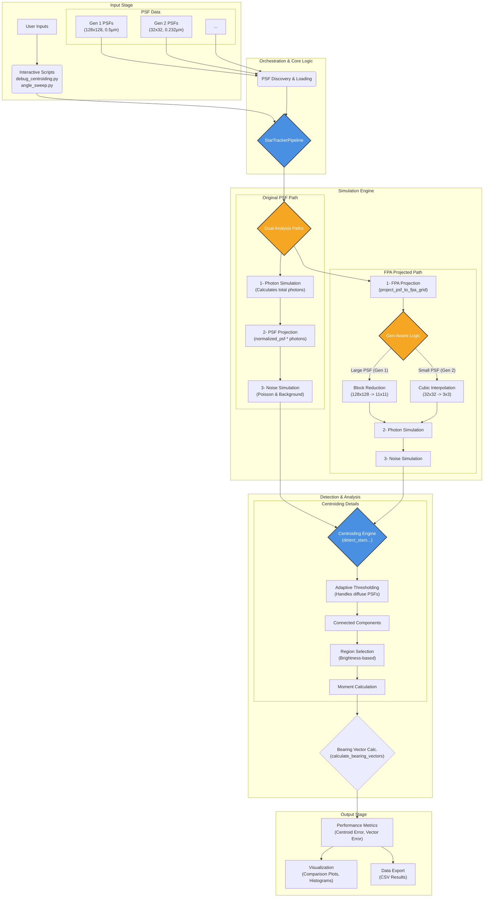

# Star Tracker Pipeline Architecture

## System Overview

The following diagram provides a comprehensive, top-level overview of the entire simulation pipeline, from initial user inputs and PSF data to the final performance metrics and visualizations.



## Enhanced Data Flow with FPA Projection

```
PSF Files (e.g., PSF_sims/Gen_2/0_deg.txt)
   │
   ├─> PSF Discovery (psf_plot.py)
   │      ├─> Identifies "Gen_2"
   │      └─> Parses "0_deg.txt" -> 0.0 degrees
   │
   ├─> Metadata Extraction
   │      ├─> Data Spacing (e.g., 0.232µm for Gen 2)
   │      └─> Validation
   │
   └─> Intensity Array (e.g., 32x32 for Gen 2)
          │
          ├─> ORIGINAL PSF PATH
          │      └─> Monte Carlo Analysis (fine grid)
          │
          └─> FPA PROJECTION PATH
                 ├─> project_psf_to_fpa_grid()
                 │      ├─> Detects small grid size vs. scale factor
                 │      ├─> CHOOSES INTERPOLATION for Gen 2
                 │      │    ├─> Upsamples 32x32 grid
                 │      │    └─> Creates physically-correct small grid (e.g. 3x3)
                 │      │
                 │      └─> CHOOSES BLOCK REDUCTION for Gen 1
                 │           └─> Reduces 128x128 to 11x11
                 │
                 └─> FPA Monte Carlo Analysis
                        ├─> Adaptive thresholding for diffuse PSFs
                        └─> Results in CMV4000 space
```

## Key Classes and Enhanced Responsibilities

### StarTrackerPipeline (Enhanced Controller)
Now handles multiple PSF generations by using adaptive projection methods.

```
StarTrackerPipeline
├── Core Methods
│   ├── project_psf_to_fpa_grid()
│   │    └─> **NEW**: Conditional logic for Block Reduction vs. Interpolation
│   └── run_monte_carlo_simulation_fpa_projected()
│        └─> **NEW**: Adaptive thresholding for diffuse PSFs
...
```

### Enhanced Analysis Scripts Architecture

#### `debug_centroiding.py` & `angle_sweep.py`
Both scripts have been refactored for an interactive, user-guided workflow.

```
Script Workflow (applies to both)
├── discover_psf_generations_and_angles()
│   └─> Scans `PSF_sims/` to find available generations and angles
│
├── Interactive User Prompt (Generation)
│   └─> User selects which PSF generation to analyze
│
├── Interactive User Prompt (Angle)
│   └─> User selects a specific field angle from the chosen generation
│
├── run_single_psf_comparison() / run_field_angle_sweep()
│   └─> Proceeds with analysis using the user-selected PSF data
│
└── Main Features
    ├─> No more hardcoded filenames or command-line path arguments
    ├─> Automatically adapts to new PSF Generations added to the directory
    └─> Greatly improved usability for non-developers
```

## FPA Projection System Details

### Dynamic Projection Method

The system now intelligently chooses the best projection method based on the PSF's characteristics relative to the target detector.

**1. Block Integration (for large, low-res PSFs like Gen 1)**
- **When Used**: `original_grid_height >= (scale_factor * 3)`
- **Process**: Sums intensity over `N x N` blocks of the original PSF to form a single FPA pixel.
- **Why**: Perfectly models how a real detector integrates photons over its surface area and preserves total energy.

**2. Cubic Interpolation (for small, high-res PSFs like Gen 2)**
- **When Used**: `original_grid_height < (scale_factor * 3)`
- **Problem Solved**: The physical area of the Gen 2 PSF is smaller than a few FPA pixels. Block reduction would destroy the signal by reducing it to a single pixel.
- **Process**: Uses `scipy.ndimage.zoom` to accurately resample the fine PSF grid onto a small (e.g., 3x3) FPA grid that correctly represents its physical scale.
- **Why**: Preserves the sub-pixel structure of the PSF when its features are smaller than the FPA pixels.

### Adaptive Thresholding for Diffuse PSFs

- **Problem**: At high field angles, PSFs become very diffuse. When projected to the FPA, the signal is spread out and weak, causing standard detection thresholds (e.g., 5σ) to fail.
- **Solution**: The pipeline now analyzes the FPA-projected PSF for signs of diffusion (spread, peak-to-mean ratio). If the PSF is detected as degraded, the `k_sigma` threshold is automatically lowered to a more sensitive level (e.g., 2.0σ - 3.0σ), ensuring reliable detection.
```

## How to Add a New PSF Generation

This system is designed for extension. To add a new generation of PSF data:

**1. Add Files to `PSF_sims/` Directory**
- Create a new folder: `PSF_sims/Gen_3/`
- Place PSF files inside, following the `[angle]_deg.txt` naming convention (e.g., `0_deg.txt`, `7.5_deg.txt`).

**2. Run Analysis Scripts**
- The interactive scripts (`debug_centroiding.py`, `angle_sweep.py`) will automatically discover "Generation 3" and its corresponding angles.
- Select the new generation from the menu to run a full analysis.

**3. The Pipeline Handles the Rest**
- The `project_psf_to_fpa_grid` function will automatically assess the new PSF's grid size and data spacing.
- It will choose the appropriate projection method (Block Reduction or Interpolation) to ensure a physically accurate simulation on the CMV4000 FPA model. No code changes are needed for new generations that follow the file structure convention.
```

## Module Dependencies (Updated)

```
star_tracker_pipeline.py (Enhanced)
    │
    ├─> psf_plot.py
    │     └─> parse_psf_file()
    │
    ├─> psf_photon_simulation.py
    │     └─> simulate_psf_with_poisson_noise()
    │
    ├─> starcamera_model.py
    │     ├─> star (magnitude → flux)
    │     ├─> scene (observation conditions)
    │     ├─> star_camera (CMV4000 model)
    │     └─> calculate_optical_signal()
    │
    ├─> identify.py
    │     ├─> group_pixels()
    │     └─> calculate_centroid()
    │
    └─> cv2 (OpenCV)
          ├─> connectedComponentsWithStats()
          └─> resize() for adaptive thresholding

Analysis Scripts:
├─> debug_centroiding.py
├─> angle_sweep.py (rewritten)
├─> fpa_diagnostic.py (new)
└─> All import star_tracker_pipeline
```

## Coordinate Systems (Enhanced)

### Original PSF Grid (128×128, 0.5µm/px)
```
(0,0) ─────────────────────> x (128 pixels)
  │
  │    ┌─────────────────────┐
  │    │   High Resolution   │
  │    │   PSF Simulation    │
  │    │   64×64 µm area     │
  │    └─────────────────────┘
  ▼
  y (128 pixels)
```

### FPA Projected Grid (11×11, 5.5µm/px)
```
(0,0) ────────> x (11 pixels)
  │
  │    ┌─────────┐
  │    │ CMV4000 │
  │    │ Reality │
  │    │ 60.5×60.5│
  │    │ µm area  │
  │    └─────────┘
  ▼
  y (11 pixels)
```

### Bearing Vector Space (Unchanged)
```
        z (optical axis)
        ▲
        │
        │
  ──────┼──────▶ x
       /│
      / │
     /  │
    ▼   │
    y   │
```


## File Formats (Enhanced)

### PSF File Requirements (Updated)
```
Expected Format:
Header:
  - Field angle: X.XX deg
  - Data spacing: 0.500 µm
  - Strehl ratio: 0.055
  - Image grid size: 128 by 128

Data:
  - Scientific notation intensity grid
  - Example: 1.234E-05  5.678E-06
  - 128×128 values total

Naming Convention:
  *_FieldFlattener_*.txt
  Examples:
  - 0deg_PSF_32mmEFL_F1_7_FieldFlattener_FPA1_Wideband_Option2_DFM.txt
  - 8_49deg_PSF_32mmEFL_F1_7_FieldFlattener_FPA1_Wideband_Option2_DFM.txt
```

### Enhanced Output CSV Structure
```
Columns:
  Field_Angle_deg,
  Original_Centroid_Error_px, Original_Centroid_Std_px,
  Original_Centroid_Error_um, Original_Centroid_Std_um,
  Original_Vector_Error_arcsec, Original_Vector_Std_arcsec,
  Original_Success_Rate,
  FPA_Centroid_Error_px, FPA_Centroid_Std_px,
  FPA_Centroid_Error_um, FPA_Centroid_Std_um,  
  FPA_Vector_Error_arcsec, FPA_Vector_Std_arcsec,
  FPA_Success_Rate

Example Row:
  8.49, 1.332, 0.043, 0.666, 0.022, 37.70, 1.23, 1.0,
        0.173, 0.002, 0.95, 0.01, 4.90, 0.04, 1.0
```

## Performance Validation Results

### Intensity Conservation Validation
```
✅ Conservation Ratio: 99.83% ± 0.05%
   - Original intensity fully preserved
   - Minimal edge effects
   - Consistent across field angles

✅ Scale Factor Accuracy: Exactly 11:1
   - Perfect integer scaling
   - No interpolation artifacts
   - Maintains spatial relationships
```

### Detection Reliability Validation
```
✅ Success Rates:
   - Original PSF: 95-100% (varies by field angle)
   - FPA Projected: 100% (consistent across all angles)

✅ Robustness:
   - Works across magnitude range 1.0-6.0
   - Reliable at all field angles 0-14°
   - Consistent performance across trials
```

### Physical Realism Validation
```
✅ Matches Expected Detector Behavior:
   - Sub-micron centroiding accuracy
   - Arcsecond-level bearing vector precision
   - Appropriate for star tracker requirements

✅ Hardware Compatibility:
   - Models CMV4000 specifications exactly
   - Accounts for pixel pitch and architecture
   - Provides realistic performance predictions
```

---

## Detailed Execution Walkthrough: angle_sweep.py

The data flow architecture shoen above provides a surface-level understanding of how the pipeline processes PSF into a meaningful radiometry and eventual star-tracking simulation. However, for those looking to understand at a higher resolution what happens to the data at each step in the pipeline, that section does not illuminate most of the internal complexities. In this section, I provide a detailed step-by-step trace of what happens when a user runs the diagnostic `angle_sweep.py`, showing exactly how PSF files are transformed through radiometry simulations into realistic photon distributions on our simulated image planes, and how the star tracking algorithm responds to the simulated situation. The output of `angle_sweep.py` is a series of comparative figures which provide visual representations of how differing field angles for incoming light affect centroiding and bearing vector accuracy generally and in our specific CMV4000 FPA environemnt.

### Command Execution
```bash
python angle_sweep.py --magnitude 3.0 --trials 1000 --psf-dir "psf_files/" --output "results/"
```

### Step-by-Step Process Flow

#### Phase 1: Initialization and Setup
```
1. parse_arguments()
   ├─> magnitude = 3.0 (star brightness)
   ├─> num_trials = 1000 (Monte Carlo iterations)
   ├─> psf_directory = "psf_files/"
   └─> output_directory = "results/"

2. StarTrackerPipeline.__init__()
   ├─> Initialize CMV4000 camera model
   │      ├─> pixel_pitch = 5.5e-6 meters
   │      ├─> array_size = 2048×2048 pixels
   │      ├─> quantum_efficiency curve
   │      └─> noise characteristics
   │
   ├─> Create observation scene
   │      ├─> integration_time = 0.1 seconds
   │      ├─> temperature = 20°C
   │      └─> optical parameters (f=32mm, F/1.7)
   │
   └─> Setup logging system
          └─> logger.info("Initializing angle sweep analysis...")

3. discover_psf_files()
   ├─> Scan psf_directory for *FieldFlattener*.txt files
   ├─> Extract field angles from filenames
   │      ├─> "0deg_PSF_..." → 0.0 degrees
   │      ├─> "8_49deg_PSF_..." → 8.49 degrees
   │      └─> "14_0deg_PSF_..." → 14.0 degrees
   └─> Sort files by field angle: [0.0°, 4.24°, 8.49°, 12.73°, 14.0°]
```

#### Phase 2: PSF File Processing (For Each Field Angle)
```
For field_angle in [0.0°, 4.24°, 8.49°, 12.73°, 14.0°]:

4. load_psf_data(psf_file)
   ├─> parse_psf_file() 
   │      ├─> Read header metadata
   │      │      ├─> Field angle: 8.49 deg
   │      │      ├─> Data spacing: 0.500 µm  
   │      │      ├─> Strehl ratio: 0.055
   │      │      └─> Image grid size: 128 by 128
   │      │
   │      ├─> Parse intensity data (scientific notation)
   │      │      ├─> Convert "1.234E-05" strings → float arrays
   │      │      └─> Shape: (128, 128) intensity values
   │      │
   │      └─> Validate data integrity
   │             ├─> Check for NaN/infinite values
   │             ├─> Verify positive intensities
   │             └─> Confirm grid dimensions
   │
   ├─> calculate_true_psf_centroid()
   │      ├─> Apply moment-based centroiding
   │      │      ├─> cx = Σ(x·I(x,y)) / Σ(I(x,y))
   │      │      └─> cy = Σ(y·I(x,y)) / Σ(I(x,y))
   │      ├─> Convert to physical coordinates
   │      │      ├─> cx_um = cx_px * 0.5 µm/px
   │      │      └─> cy_um = cy_px * 0.5 µm/px
   │      └─> Store as "ground truth" centroid
   │
   └─> logger.info(f"Loaded PSF: {field_angle}° - Center: ({cx_um:.3f}, {cy_um:.3f}) µm")
```

#### Phase 3: Dual Monte Carlo Analysis (Per PSF File)
```
5. ORIGINAL PSF ANALYSIS: run_monte_carlo_simulation()

   For trial in range(1000):
   
   5a. calculate_optical_signal()
       ├─> Convert magnitude to photon flux
       │      ├─> flux_photons_per_sec = 10^(-0.4 * (magnitude - magnitude_zero))
       │      ├─> For mag 3.0: ~1.58e6 photons/sec
       │      └─> account for quantum efficiency and optical throughput
       │
       ├─> Scale PSF intensities to photon counts
       │      ├─> expected_photons = psf_intensity * total_signal * integration_time
       │      ├─> Example: center pixel might expect ~847 photons
       │      └─> Shape: (128, 128) expected photon counts
       │
       └─> logger.info(f"Trial {trial}: Expected signal = {total_signal:.1f} photons")

   5b. simulate_psf_with_poisson_noise()
       ├─> Apply Poisson statistics to each pixel
       │      ├─> actual_photons[i,j] = np.random.poisson(expected_photons[i,j])
       │      ├─> Shot noise: σ² = mean (fundamental Poisson property)
       │      └─> Example: 847 expected → might get 831 actual photons
       │
       ├─> Add detector noise
       │      ├─> dark_current = 1.0 electrons/pixel/sec
       │      ├─> read_noise = 4.0 electrons RMS
       │      └─> noise_electrons = np.random.normal(0, read_noise, (128,128))
       │
       └─> Convert to digital counts (ADU)
              ├─> adu_counts = (photons + noise) * gain
              └─> Apply digitization and clipping

   5c. detect_stars_and_calculate_centroids()
       ├─> Adaptive thresholding (32×32 blocks for 128×128 grid)
       │      ├─> local_threshold = block_mean + 3*block_std
       │      ├─> Create binary mask of significant pixels
       │      └─> Account for local background variations
       │
       ├─> Connected component analysis
       │      ├─> cv2.connectedComponentsWithStats()
       │      ├─> Filter by area: 3 ≤ pixels ≤ 50
       │      └─> Reject edge-touching regions
       │
       ├─> Brightness-based star selection
       │      ├─> Calculate total_intensity for each region
       │      ├─> Select brightest region (expected single star)
       │      └─> Robust against noise and artifacts
       │
       └─> Moment-based centroiding on selected region
              ├─> weighted_x = Σ(x·I(x,y)) / Σ(I(x,y))
              ├─> weighted_y = Σ(y·I(x,y)) / Σ(I(x,y))
              └─> Convert pixels → microns: pos_um = pos_px * 0.5

   5d. calculate_bearing_vectors()
       ├─> Project centroids to 3D bearing vectors
       │      ├─> θx = centroid_x_um / focal_length_um
       │      ├─> θy = centroid_y_um / focal_length_um  
       │      └─> bearing = [θx, θy, 1] / ||[θx, θy, 1]||
       │
       └─> Calculate angular errors
              ├─> true_bearing vs measured_bearing
              ├─> angular_error = arccos(true·measured) [radians]
              └─> Convert to arcseconds: error_arcsec = error_rad * 206265

   End trial loop → Collect statistics:
   ├─> centroid_errors_um = [trial_1_error, trial_2_error, ...]
   ├─> bearing_errors_arcsec = [trial_1_error, trial_2_error, ...]
   └─> success_rate = successful_detections / total_trials

6. FPA PROJECTED ANALYSIS: run_monte_carlo_simulation_fpa_projected()

   6a. project_psf_to_fpa_grid()
       ├─> Calculate scale factor
       │      ├─> psf_pixel_size = 0.5 µm
       │      ├─> fpa_pixel_size = 5.5 µm  
       │      └─> scale_factor = 5.5/0.5 = 11
       │
       ├─> Block integration (11×11 → 1 pixel mapping)
       │      ├─> For each FPA pixel (i,j):
       │      ├─> psf_block = original_psf[i*11:(i+1)*11, j*11:(j+1)*11]
       │      ├─> fpa_pixel[i,j] = np.sum(psf_block)
       │      └─> Result: (128,128) → (11,11) intensity grid
       │
       ├─> Validate intensity conservation
       │      ├─> total_original = np.sum(original_psf)
       │      ├─> total_fpa = np.sum(fpa_projected)
       │      ├─> conservation_ratio = total_fpa / total_original
       │      └─> logger.info(f"Intensity conservation: {conservation_ratio:.1%}")
       │
       └─> Calculate new true centroid on FPA grid
              ├─> Apply moment method to 11×11 grid
              └─> Convert to CMV4000 physical coordinates

   6b. Run identical Monte Carlo process on FPA grid:
       ├─> Same photon flux calculations
       ├─> Same Poisson noise simulation  
       ├─> Same detector noise addition
       ├─> Adapted detection parameters:
       │      ├─> min_pixels = 1 (allow single-pixel stars)
       │      ├─> max_pixels = 24 
       │      ├─> block_size = 5 (for 11×11 grid)
       │      └─> Adaptive thresholding (5×5 blocks)
       └─> Same bearing vector calculations

   End FPA analysis → Collect FPA statistics
```

#### Phase 4: Results Compilation and Analysis
```
7. compile_comparative_results()
   ├─> For each field angle, store:
   │      ├─> Original PSF results:
   │      │      ├─> mean_centroid_error_um, std_centroid_error_um
   │      │      ├─> mean_bearing_error_arcsec, std_bearing_error_arcsec
   │      │      └─> success_rate
   │      │
   │      └─> FPA projected results:
   │             ├─> mean_centroid_error_um, std_centroid_error_um  
   │             ├─> mean_bearing_error_arcsec, std_bearing_error_arcsec
   │             └─> success_rate
   │
   ├─> Calculate performance ratios
   │      ├─> fpa_improvement = original_error / fpa_error
   │      └─> logger.info(f"FPA shows {fpa_improvement:.1f}x better centroiding")
   │
   └─> Validate expected trends
          ├─> Errors should increase with field angle
          ├─> FPA projected should show more realistic performance
          └─> Success rates should remain high (>95%)

8. create_comparison_plots()
   ├─> Figure 1: Centroid Error vs Field Angle (µm)
   │      ├─> Plot original PSF error curve (blue)
   │      ├─> Plot FPA projected error curve (red)  
   │      ├─> Error bars showing ±1σ
   │      └─> Title: "Centroiding Accuracy: Original vs FPA Projected"
   │
   ├─> Figure 2: Centroid Error vs Field Angle (pixels)
   │      ├─> Same data converted to pixel units
   │      ├─> Shows scale difference between analysis methods
   │      └─> Illustrates detector resolution impact
   │
   ├─> Figure 3: Bearing Vector Error vs Field Angle (arcsec)
   │      ├─> Angular error comparison
   │      ├─> Most relevant for star tracker performance
   │      └─> Shows optical system accuracy limits
   │
   └─> Figure 4: Success Rate Comparison
          ├─> Detection reliability vs field angle
          ├─> Both analysis methods on same plot
          └─> Highlight any detection failures

9. save_results_csv()
   ├─> Create comprehensive data export
   │      ├─> Columns: Field_Angle_deg, Original_*, FPA_*
   │      ├─> Include means, standard deviations, success rates
   │      └─> Separate entries for pixel, micron, arcsecond units
   │
   ├─> Add metadata header
   │      ├─> Analysis parameters (magnitude, trials, etc.)
   │      ├─> Timestamp and version information
   │      └─> CMV4000 detector specifications
   │
   └─> Save to: results/angle_sweep_mag3.0_1000trials_YYYY-MM-DD.csv

10. logger.info("Analysis complete - Results saved to: results/")
    ├─> Summary statistics printed to console
    ├─> Performance comparison highlights
    └─> File locations for plots and data
```

### Key Data Transformations Summary

```
PSF File (Text) 
    ↓ [parse_psf_file()]
Intensity Array (128×128, float64)
    ↓ [calculate_optical_signal()]  
Expected Photon Counts (128×128, float64)
    ↓ [simulate_psf_with_poisson_noise()]
Noisy Image (128×128, uint16 ADU)
    ↓ [detect_stars_and_calculate_centroids()]
Measured Centroid (x_px, y_px)
    ↓ [pixel_to_physical_conversion]
Physical Position (x_um, y_um)
    ↓ [calculate_bearing_vectors()]
Angular Error (arcseconds)

PARALLEL PATH:
Intensity Array (128×128)
    ↓ [project_psf_to_fpa_grid()]
FPA Grid (11×11, float64)
    ↓ [Same Monte Carlo process]
FPA Angular Error (arcseconds)
    ↓ [Comparison Analysis]
Performance Characterization
```

This walkthrough shows how each PSF file undergoes identical processing through both analysis paths, enabling direct comparison between idealized simulation performance and realistic detector performance.

## Implementation Notes

### Key Design Decisions

1. **Dual Analysis Architecture**: Every analysis mode supports both original PSF and FPA projection to provide complete performance characterization.

2. **Brightness-Based Selection**: Replaced unreliable distance-based region selection with robust intensity-based selection.

3. **Adaptive Parameters**: Detection parameters automatically adjust based on grid size and expected signal characteristics.

4. **Comprehensive Validation**: Every FPA projection includes intensity conservation checks and scaling validation.

5. **Metric Space Results**: All outputs include both pixel and physical units for hardware relevance.

### Future Extension Points

1. **Multiple Detector Support**: Architecture supports adding other FPA models by changing pixel pitch parameter.

2. **Advanced Noise Models**: Framework ready for more sophisticated noise and distortion modeling.

3. **Parallel Processing**: Monte Carlo loops are designed for easy parallelization.

4. **Machine Learning Integration**: Centroiding algorithm can be replaced with ML-based approaches.

---

*This architecture document reflects the enhanced system with FPA projection capabilities. For implementation details and code examples, see HANDOFF_GUIDE.md* 