# Analytical Impossibility: The Compounding Error Propagation Problem

This diagram illustrates why finding a closed-form analytical solution for star tracker attitude error is mathematically intractable. Each stage introduces new error sources that interact with previous uncertainties in increasingly complex ways.

```mermaid
flowchart LR
    %% Top row - Processing Stages
    A["`**Stage 1: Scene Generation**
    *Euler angles → Pixel coordinates*
    
    **Manageable**: Linear transformations
    **Math**: Matrix multiplication
    **Still analytical**`"] --> B["`**Stage 2: Radiometric Chain**
    *Magnitude → Photon flux → Electrons*
    
    ⚠️ **Complexity grows**: Nonlinear magnitude scale
    📐 **Math**: Exponential relationships
    🤔 **Analytical still possible**`"]
    
    B --> C["`**Stage 3: Statistical Image Formation**
    *Deterministic signal → Noisy pixels*
    
    ❌ **Stochastic processes**: Poisson arrivals
    📐 **Math**: Probability distributions
    🚫 **Analytical solutions limited**`"]
    
    C --> D["`**Stage 4: Detection & Centroiding**
    *Noisy image → Sub-pixel positions*
    
    ❌ **Threshold dependencies**: Adaptive algorithms
    📐 **Math**: Weighted statistics
    🚫 **Case-by-case solutions only**`"]
    
    D --> E["`**Stage 5: Bearing Vector Geometry**
    *Pixels → 3D unit vectors*
    
    ❌ **Error propagation**: Linear error→Angular error
    📐 **Math**: Trigonometric error propagation
    ⚠️ **Coupled with all previous stages**`"]
    
    E --> F["`**Stage 6: Pattern Recognition**
    *3D vectors → Star identifications*
    
    ❌ **Combinatorial explosion**: Matching algorithms
    📐 **Math**: Graph theory, optimization
    🚫 **No closed-form solutions**`"]
    
    F --> G["`**Stage 7: Attitude Estimation**
    *Matched vectors → Optimal quaternion*
    
    ❌ **Optimization problem**: Eigenvalue solutions
    📐 **Math**: Linear algebra, statistics
    🚫 **ANALYTICALLY IMPOSSIBLE**`"]
    
    %% Bottom row - Error Sources
    A_err["`**Error Sources:**
    • Focal length uncertainty: ±0.1%
    • Principal point drift: ±1 pixel
    • Rotation matrix precision
    • Projection approximations`"] --> B_err["`**Error Sources:**
    • Pogson scale: 2.512^(-m) nonlinearity
    • QE variations: ±5% across detector
    • Dark current: Temperature dependent
    • Transmission losses: Wavelength dependent`"]
    
    B_err --> C_err["`**Error Sources:**
    • Shot noise: √N variance (Poisson)
    • Read noise: Gaussian (σr² variance)
    • Dark current noise: √(Id·t)
    • PSF sampling errors: ~p/12 pixels`"]
    
    C_err --> D_err["`**Error Sources:**
    • Threshold sensitivity: k·σ parameter
    • Window truncation: Exponential bias
    • Background variations: Non-uniform
    • Cramér-Rao bound: σpsf/√Nph limit`"]
    
    D_err --> E_err["`**Error Sources:**
    • Pixel uncertainty: Δθ ≈ (p/f)√(δu² + δv²)
    • Calibration drift: Temperature effects
    • Distortion residuals: Polynomial corrections
    • All previous errors propagate forward`"]
    
    E_err --> F_err["`**Error Sources:**
    • Angular tolerance: |θobs - θcat| < Δθtol
    • False positive rate: ~N(Δθtol/π)³
    • Combinatorial complexity: O(n³) triplets
    • Confidence scoring: Heuristic weights`"]
    
    F_err --> G_err["`**Final Error Sources:**
    • Wahba's problem: Matrix eigenvalues
    • Monte Carlo uncertainty: Statistical estimation
    • Residual validation: Iterative checking
    • **ALL 6 PREVIOUS STAGES COMPOUND HERE**`"]
    
    %% Vertical connections between stages and errors
    A -.-> A_err
    B -.-> B_err
    C -.-> C_err
    D -.-> D_err
    E -.-> E_err
    F -.-> F_err
    G -.-> G_err
    
    %% Final impossibility conclusion
    G --> IMPOSSIBLE["`**ANALYTICAL IMPOSSIBILITY**
    **Why no closed-form solution exists:**
    **Stochastic processes**: Poisson noise breaks determinism
    **Nonlinear coupling**: Each stage feeds complex errors forward
    **Combinatorial explosion**: Pattern matching has no analytical bounds
    **High dimensionality**: 7+ error sources interact multiplicatively
    **Hardware dependencies**: Real-world variations break idealizations
    **Result: Monte Carlo simulation is the ONLY practical approach**`"]
    
    G_err --> IMPOSSIBLE
    
    %% Styling
    classDef stage fill:#e1f5fe,stroke:#01579b,stroke-width:2px,color:#000
    classDef error fill:#fff3e0,stroke:#ef6c00,stroke-width:1px,color:#000
    classDef impossible fill:#ffebee,stroke:#c62828,stroke-width:3px,color:#000
    
    class A,B,C,D,E,F,G stage
    class A_err,B_err,C_err,D_err,E_err,F_err,G_err error
    class IMPOSSIBLE impossible
```

## Key Insights from the Error Propagation Analysis

### Mathematical Complexity Growth
1. **Stage 1-2**: Linear and exponential relationships - still analytically tractable
2. **Stage 3**: Introduction of stochastic processes breaks determinism
3. **Stage 4-5**: Adaptive algorithms and geometric error amplification
4. **Stage 6**: Combinatorial explosion in pattern matching
5. **Stage 7**: All previous uncertainties compound in a high-dimensional optimization

### Why Analytical Solutions Fail

The fundamental issue isn't just mathematical complexity—it's the **cascade of uncertainty interactions**:

- **Poisson noise** in Stage 3 introduces irreducible randomness
- **Adaptive thresholding** in Stage 4 creates decision boundaries that vary with noise
- **Pattern matching** in Stage 6 involves discrete combinatorial choices
- **Error correlation** between stages creates non-separable covariance matrices

### The Monte Carlo Necessity

This error cascade demonstrates why the radiometry simulation pipeline **must** use Monte Carlo methods:

1. **No closed-form PDFs exist** for the compound error distribution
2. **Hardware variations** break theoretical models unpredictably  
3. **Real-world conditions** introduce correlations impossible to model analytically
4. **Mission-critical reliability** requires statistical confidence bounds

The diagram shows that while each individual stage might have analytical components, their **composition** creates an analytically intractable system—hence the fundamental need for simulation-based approaches in star tracker design and validation.