# BAST System Architecture: Algorithm Embedded in Radiometric Simulation

This diagram illustrates how the BAST (Basic Astronomical Star Tracker) algorithms are seamlessly integrated within the complete radiometric simulation pipeline, creating a comprehensive digital twin for star tracker systems.

```mermaid
flowchart TD
    %% Input Sources
    subgraph INPUTS["🔄 INPUT SOURCES"]
        PSF["`**Zemax PSF Files**
        • Gen_1: 128×128 (0.5µm/px)
        • Gen_2: 32×32 (0.232µm/px)
        • Field angles: 0° to 14°
        • Optical aberrations included`"]
        
        CAT["`**Star Catalogs**
        • Hipparcos/Gaia data
        • Magnitude filtering
        • RA/Dec coordinates
        • Multi-star configurations`"]
        
        CONFIG["`**System Configuration**
        • CMV4000 sensor specs
        • Optical parameters
        • Integration times
        • Temperature settings`"]
    end

    %% Core Simulation Engine
    subgraph CORE["⚙️ RADIOMETRIC SIMULATION CORE"]
        PIPELINE["`**StarTrackerPipeline**
        *Core simulation controller*
        
        • PSF loading & validation
        • Camera model management  
        • Scene parameter control
        • Monte Carlo orchestration`"]
        
        subgraph RADIOMETRY["📡 Radiometric Chain"]
            PHOTON["`**Photon Simulation**
            • Magnitude → flux conversion
            • Quantum efficiency modeling
            • Poisson noise generation
            • Dark current addition`"]
            
            SENSOR["`**Sensor Modeling**
            • CMV4000 pixel response
            • Read noise simulation
            • Saturation effects
            • Temperature dependencies`"]
        end
        
        subgraph PROJECTION["📐 PSF Projection"]
            FPAPROJ["`**FPA Projection**
            • Block reduction (Gen_1)
            • Interpolation (Gen_2)
            • Pixel pitch scaling
            • Intensity conservation`"]
            
            IMGFORM["`**Image Formation**
            • Noisy detector images
            • Background simulation
            • Multiple realizations
            • Statistical validation`"]
        end
    end

    %% BAST Algorithm Integration
    subgraph BAST_CORE["🎯 BAST ALGORITHM CORE"]
        DETECT["`**Star Detection**
        *BAST.identify module*
        
        • Adaptive thresholding
        • Connected components
        • Region validation
        • Multi-star handling`"]
        
        CENTROID["`**Centroiding**
        *Sub-pixel accuracy*
        
        • Moment-based calculation
        • Weighted intensity centers
        • Error propagation
        • Cramér-Rao bounds`"]
        
        BEARING["`**Bearing Vectors**
        *Geometric transformation*
        
        • Pixel → angular conversion
        • Camera calibration
        • Distortion correction
        • 3D unit vectors`"]
    end

    %% Advanced BAST Capabilities  
    subgraph BAST_ADV["🚀 ADVANCED BAST PROCESSING"]
        CATALOG["`**Catalog Management**
        *BAST.catalog module*
        
        • Star database indexing
        • Magnitude filtering
        • Coordinate transformations
        • Search optimization`"]
        
        MATCH["`**Triangle Matching**
        *BAST.match module*
        
        • Invariant feature extraction
        • Combinatorial search
        • Angular tolerance handling
        • Confidence scoring`"]
        
        QUEST["`**Attitude Determination**
        *BAST.resolve module*
        
        • QUEST algorithm
        • Monte Carlo uncertainty
        • Optimal rotation estimation
        • Covariance analysis`"]
    end

    %% Multi-Star Extensions
    subgraph MULTISTAR["🌟 MULTI-STAR CAPABILITIES"]
        SCENE["`**Scene Generation**
        *Multi-star pipeline*
        
        • Attitude transformations
        • Multiple star placement
        • Field-of-view validation
        • Ground truth tracking`"]
        
        RADIOM["`**Multi-Star Radiometry**
        *Comprehensive simulation*
        
        • Multiple PSF placement
        • Intensity superposition
        • Cross-star interference
        • Realistic noise modeling`"]
        
        VALID["`**Validation Framework**
        *Angular preservation*
        
        • Ground truth comparison
        • Error propagation analysis
        • Performance metrics
        • Statistical validation`"]
    end

    %% Output Products
    subgraph OUTPUTS["📊 OUTPUT PRODUCTS"]
        PERF["`**Performance Metrics**
        • Centroiding accuracy
        • Bearing vector errors  
        • Success rates
        • Confidence intervals`"]
        
        ATT["`**Attitude Solutions**
        • Quaternion estimates
        • Uncertainty bounds
        • Residual analysis
        • Monte Carlo statistics`"]
        
        VIS["`**Visualizations**
        • Error plots
        • Statistical distributions
        • Comparative analysis
        • Diagnostic imagery`"]
    end

    %% Data Flow Connections
    PSF --> PIPELINE
    CAT --> CATALOG
    CONFIG --> PIPELINE
    
    PIPELINE --> PHOTON
    PIPELINE --> FPAPROJ
    
    PHOTON --> SENSOR
    SENSOR --> IMGFORM
    FPAPROJ --> IMGFORM
    
    IMGFORM --> DETECT
    DETECT --> CENTROID
    CENTROID --> BEARING
    
    BEARING --> MATCH
    CATALOG --> MATCH
    MATCH --> QUEST
    
    PIPELINE --> SCENE
    SCENE --> RADIOM
    RADIOM --> VALID
    
    QUEST --> ATT
    VALID --> PERF
    ATT --> VIS
    PERF --> VIS

    %% Feedback Loops
    PERF -.-> PIPELINE
    VALID -.-> SCENE
    
    %% Styling
    classDef input fill:#e1f5fe,stroke:#01579b,stroke-width:2px,color:#000
    classDef core fill:#f3e5f5,stroke:#4a148c,stroke-width:2px,color:#000
    classDef bast fill:#e8f5e8,stroke:#2e7d32,stroke-width:2px,color:#000
    classDef advanced fill:#fff3e0,stroke:#ef6c00,stroke-width:2px,color:#000
    classDef multistar fill:#fce4ec,stroke:#c2185b,stroke-width:2px,color:#000
    classDef output fill:#f1f8e9,stroke:#558b2f,stroke-width:2px,color:#000
    
    class PSF,CAT,CONFIG input
    class PIPELINE,PHOTON,SENSOR,FPAPROJ,IMGFORM core
    class DETECT,CENTROID,BEARING bast
    class CATALOG,MATCH,QUEST advanced
    class SCENE,RADIOM,VALID multistar
    class PERF,ATT,VIS output
```

## Key Integration Points

### 1. **Seamless Algorithm Embedding**
- BAST algorithms operate directly on radiometrically accurate detector images
- No artificial separation between simulation and processing
- Realistic noise and artifacts included in algorithm testing

### 2. **Multi-Scale Validation**
- **Component Level**: Individual BAST modules tested in isolation
- **System Level**: Complete pipeline validation with ground truth
- **Statistical Level**: Monte Carlo analysis of algorithm performance

### 3. **Hardware-Algorithm Co-Design**
- Sensor characteristics directly influence algorithm parameters
- PSF quality affects centroiding and matching performance
- Temperature effects propagate through entire signal chain

### 4. **Advanced Capabilities Integration**
- **Attitude Transformations**: Realistic spacecraft orientations
- **Multi-Star Scenes**: Complex field configurations
- **Uncertainty Quantification**: Complete error propagation from photons to attitude

## Technical Architecture Benefits

### **Physical Realism**
- Every photon simulated with proper statistics
- Optical aberrations from real lens designs
- Hardware-accurate sensor modeling

### **Algorithm Validation** 
- Performance tested under realistic conditions
- Error sources properly modeled and propagated
- Statistical confidence in results

### **System Optimization**
- Trade-offs between optical design and algorithm performance
- Sensor selection based on algorithm requirements  
- Mission-specific performance predictions

### **Scalable Framework**
- Modular design allows component upgrades
- New algorithms easily integrated
- Multiple sensor architectures supported

This architecture demonstrates how BAST algorithms are not just post-processing tools, but integral components of a comprehensive star tracker digital twin that encompasses the complete signal chain from starlight to spacecraft attitude.