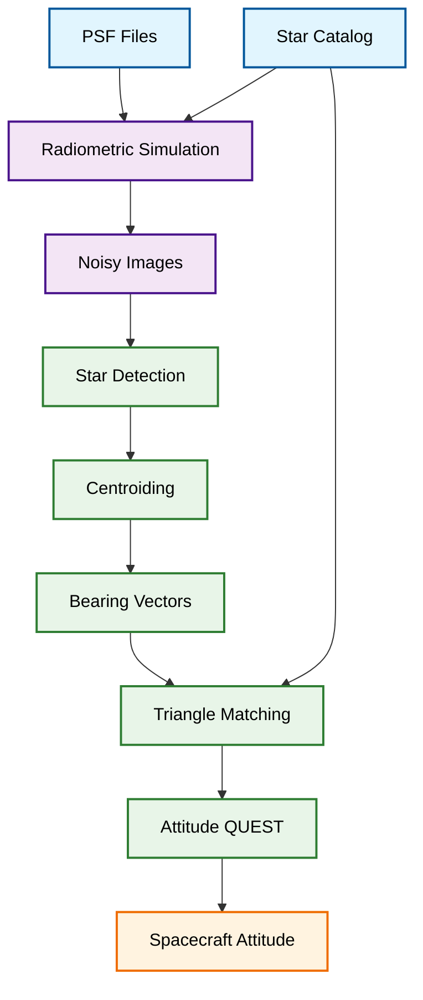

# BAST System Architecture: Algorithm Embedded in Radiometric Simulation

```mermaid
flowchart TD
    PSF["PSF Files"] --> SIM["Radiometric Simulation"]
    CAT["Star Catalog"] --> SIM
    
    SIM --> NOISE["Noisy Images"]
    
    NOISE --> DETECT["Star Detection"]
    DETECT --> CENTROID["Centroiding"] 
    CENTROID --> BEARING["Bearing Vectors"]
    
    BEARING --> MATCH["Triangle Matching"]
    CAT --> MATCH
    MATCH --> QUEST["Attitude QUEST"]
    
    QUEST --> ATTITUDE["Spacecraft Attitude"]
    
    %% Styling
    classDef input fill:#e1f5fe,stroke:#01579b,stroke-width:2px,color:#000
    classDef sim fill:#f3e5f5,stroke:#4a148c,stroke-width:2px,color:#000
    classDef bast fill:#e8f5e8,stroke:#2e7d32,stroke-width:2px,color:#000
    classDef output fill:#fff3e0,stroke:#ef6c00,stroke-width:2px,color:#000
    
    class PSF,CAT input
    class SIM,NOISE sim
    class DETECT,CENTROID,BEARING,MATCH,QUEST bast
    class ATTITUDE output
```

**BAST algorithms embedded in complete radiometric simulation pipeline**