```mermaid
graph TD
    subgraph "Input & Configuration"
        UserInput["Orchestration Scripts<br/>(debug_centroiding.py, angle_sweep.py)"]
        PSF_Dir["PSF Data Directory<br/>(Gen 1, Gen 2, Gen 3)"]
        BAST_Catalog["BAST/catalog.py<br/>(Star Catalogs)"]
        
        UserInput --> PipelineInit
    end

    subgraph "Initialization"
        PipelineInit("StarTrackerPipeline Initialization")
        CameraModel["starcamera_model.py<br/>(Camera, Optic, FPA)"]
        SceneModel["starcamera_model.py<br/>(Scene)"]
        PSFLoad["load_psf_data()<br/>(Parses PSF files)"]

        PipelineInit --> CameraModel
        PipelineInit --> SceneModel
        PSF_Dir --> PSFLoad
        PSFLoad --> PipelineInit
    end
    
    subgraph "Core Simulation Engine"
        PipelineInit --> SimSelector{"Analysis Path?"}

        SimSelector -- "Original PSF Grid" --> SimPathOrig
        SimSelector -- "FPA Projected Grid" --> FPA_Projection

        subgraph "Path 1: Original PSF Simulation"
            direction TB
            SimPathOrig("run_monte_carlo_simulation") --> PhotonSimOrig["Photon Simulation<br/>(calculate_optical_signal)"]
            PhotonSimOrig --> NoiseSimOrig["Noise Simulation<br/>(psf_photon_simulation.py)"]
            NoiseSimOrig --> DetectOrig["Detection & Centroiding<br/>(detect_stars_and_calculate_centroids)"]
            DetectOrig --> BearingCalcOrig["Bearing Vector Calculation<br/>(Uses Original PSF Pixel Pitch)"]
        end

        subgraph "Path 2: FPA-Projected Simulation"
            direction TB
            FPA_Projection("project_psf_to_fpa_grid()") --> GenAware{"Gen-Aware Logic"}
            GenAware -- "Gen 1 (Coarse PSF)" --> BlockReduce["skimage.block_reduce<br/>(Downsample)"]
            GenAware -- "Gen 2 (Fine PSF)" --> Interpolate["scipy.ndimage.zoom<br/>(Upsample/Interpolate)"]
            
            BlockReduce --> SimPathFPA
            Interpolate --> SimPathFPA
            
            SimPathFPA("run_monte_carlo_simulation_fpa_projected") --> PhotonSimFPA["Photon Simulation"]
            PhotonSimFPA --> NoiseSimFPA["Noise Simulation"]
            NoiseSimFPA --> DetectFPA["Detection & Centroiding<br/>(Adjusted Params for FPA grid)"]
            DetectFPA --> BearingCalcFPA["Bearing Vector Calculation<br/>(Uses FPA Pixel Pitch, e.g., 5.5µm)"]
        end
    end

    subgraph "Detection Details (BAST Integration)"
        style DetectOrig fill:#4A90E2,color:#fff
        style DetectFPA fill:#4A90E2,color:#fff

        DetectOrig --> AdaptiveThresh["Adaptive Local Threshold"]
        DetectFPA --> AdaptiveThresh
        AdaptiveThresh --> ConnectedComp["cv2.connectedComponentsWithStats<br/>(Pixel Grouping)"]
        ConnectedComp --> RegionSelect["Region Selection<br/>(Filter by size, select brightest)"]
        RegionSelect --> CentroidCalc["identify.calculate_centroid<br/>(Intensity-weighted moment)"]
    end

    subgraph "Analysis & Output"
        BearingCalcOrig --> Aggregation["Results Aggregation<br/>(Mean/Std Error)"]
        BearingCalcFPA --> Aggregation
        
        Aggregation --> Visualization["Visualization<br/>(matplotlib plots)"]
        Aggregation --> Export["Data Export<br/>(pandas to .csv)"]
    end
    
    subgraph "Full BAST Attitude Pipeline (Context)"
        CentroidCalc --> BAST_Match["BAST/match.py<br/>(Pattern Matching)"]
        SyntheticCatalog --> BAST_Match
        BAST_Catalog --> BAST_Match
        BAST_Match --> BAST_Resolve["BAST/resolve.py<br/>(Attitude Solution - QUEST)"]
        BAST_Resolve --> FinalAttitude["Final Attitude<br/>(Quaternion)"]
    end

    subgraph "Multi-Star Simulation Additions"
        direction LR
        subgraph "Synthetic Scene Generation"
            direction TB
            SynthCatBuilder["SyntheticCatalogBuilder<br/>(multi_star/synthetic_catalog.py)"] --> SyntheticCatalog["Synthetic Catalog<br/>(3 or 4 stars w/ Ground Truth)"]
            SyntheticCatalog --> SceneGen["MultiStarSceneGenerator<br/>(Calculates detector positions)"]
            PipelineInit --> SceneGen
            
            %% New Attitude Transformation Components
            AttitudeInput["True Attitude Input<br/>(Quaternion or Euler Angles)"] --> AttitudeMode{"Attitude<br/>Transformation<br/>Mode?"}
            AttitudeMode -- "Identity/Legacy" --> LegacyProjection["Legacy Gnomonic Projection<br/>(_generate_scene_legacy)"]
            AttitudeMode -- "Arbitrary Attitude" --> AttitudeTransform["Attitude Transformation<br/>(_generate_scene_with_attitude_transform)"]
            
            subgraph "Attitude Transform Pipeline"
                direction TB
                AttitudeTransform --> CatalogToInertial["Convert RA/Dec to Inertial Vectors<br/>(radec_to_inertial_vector)"]
                CatalogToInertial --> AttitudeRotation["Apply Attitude Rotation<br/>(quaternion_to_rotation_matrix<br/>or euler_to_rotation_matrix)"]
                AttitudeRotation --> CameraFrame["Transform to Camera Frame<br/>(transform_to_camera_frame)"]
                CameraFrame --> FocalPlaneProj["Project to Focal Plane<br/>(project_to_focal_plane)"]
                FocalPlaneProj --> PixelConvert["Convert to Pixels<br/>(focal_plane_to_pixels)"]
                PixelConvert --> BoundsFilter["Filter Detector Bounds<br/>(filter_detector_bounds)"]
            end
            
            LegacyProjection --> SceneData["Scene Data<br/>(Star Positions, Ground Truth)"]
            BoundsFilter --> SceneData
            SceneGen --> AttitudeMode
        end

        subgraph "Multi-Star Image Rendering"
            direction TB
            SceneData --> Radiometry["MultiStarRadiometry.render_scene<br/>(Stamps PSFs onto canvas)"]
            SimPathOrig --> Radiometry
            SimPathFPA --> Radiometry
            Radiometry --> PSFPlacement{"PSF Placement Method"}
            PSFPlacement -- "Legacy (Integer)" --> IntegerPlace["_place_psf_at_position<br/>(Integer pixel placement)"]
            PSFPlacement -- "Enhanced (Sub-pixel)" --> SubPixelPlace["_place_psf_at_position_subpixel<br/>(scipy.ndimage.shift interpolation)"]
            
            IntegerPlace --> MultiStarImage["Multi-Star Detector Image"]
            SubPixelPlace --> MultiStarImage
            SubPixelPlace --> GroundTruthTracking["Actual PSF Center Storage<br/>(star['actual_psf_center'])"]
        end

        subgraph "Alternative Detection Method"
            direction TB
            MultiStarImage --> PeakDetect["detect_stars_peak_method<br/>(Finds local maxima)"]
            PeakDetect --> RefineCentroid["refine_centroid_moment<br/>(Calculates moments in window)"]
            RefineCentroid --> CentroidCalc
        end

        MultiStarImage --> DetectOrig
        MultiStarImage --> DetectFPA
        
        subgraph "Error Tracking & Analysis Framework"
            direction TB
            ErrorTracker["PipelineErrorTracker<br/>(Tracks errors through stages)"]
            ErrorMeasurement["ErrorMeasurement<br/>(Individual error records)"]
            
            GroundTruthTracking --> ErrorTracker
            CentroidCalc --> ErrorTracker
            BearingCalcOrig --> ErrorTracker
            BearingCalcFPA --> ErrorTracker
            
            ErrorTracker --> ErrorMeasurement
            ErrorMeasurement --> ErrorAnalysis["Error Propagation Analysis<br/>(Stage-by-stage breakdown)"]
        end
        
        subgraph "Star Matching & Coordinate System"
            direction TB
            CentroidCalc --> StarMatching["Star Matching Logic<br/>(Spatial proximity matching)"]
            GroundTruthTracking --> StarMatching
            SceneData --> CoordTransform["Coordinate Transformations<br/>(RA/Dec ↔ Bearing Vectors)"]
            CoordTransform --> SphericalConvert["Spherical-to-Cartesian<br/>(cos(dec)*cos(ra), cos(dec)*sin(ra), sin(dec))"]
            
            StarMatching --> MatchedPairs["Matched Star Pairs<br/>(Observed ↔ Catalog correspondence)"]
            SphericalConvert --> MatchedPairs
            MatchedPairs --> AngleComparison["Inner-Angle Calculations<br/>(Proper star pair matching)"]
        end

        subgraph "Attitude Solution & Validation"
            direction TB
            
            subgraph "Attitude Determination"
                direction TB
                MatchedPairs --> AttitudeSolver{"Attitude Solver"}
                AttitudeSolver -- "SVD Solver (Wahba's Problem)" --> SVDSolve["SVD Attitude Solution<br/>(Finds best-fit rotation)"]
                AttitudeSolver -- "Monte Carlo QUEST" --> MC_QUEST["Monte Carlo QUEST<br/>(Robust attitude w/ uncertainty)"]
                
                SVDSolve --> SolvedAttitude["Solved Attitude Matrix"]
                MC_QUEST --> SolvedAttitude
            end
            
            subgraph "Error & Validation"
                direction TB
                SolvedAttitude --> ResidualError["Calculate Residual Error<br/>(Compares rotated true vectors<br/>with measured vectors)"]
                ResidualError --> ValidationStep["Validation"]
                AngleComparison --> ValidationStep
                ErrorAnalysis --> ValidationStep
                AttitudeValidation["Attitude Transformation Validation"]
                AttitudeValidation --> ValidationStep
            end

            ValidationStep --> ValidationResults["Validation Results<br/>(Match Correctness, Error Budget,<br/>Residual Error, Angular Preservation)"]
        end
        
        subgraph "Attitude Testing Framework"
            direction TB
            AttitudeSweep["Attitude Sweep Analysis<br/>(run_attitude_sweep_analysis)"]
            RandomAttitudes["Random Attitude Generation<br/>(random_quaternion, random_euler_angles)"]
            AttitudeMetrics["Attitude Performance Metrics<br/>(Success rates, Angular errors)"]
            
            RandomAttitudes --> AttitudeSweep
            AttitudeInput --> AttitudeSweep
            AttitudeSweep --> AttitudeMetrics
            AttitudeMetrics --> ValidationResults
        end
    end

    style SimSelector fill:#F5A623,color:#fff
    style GenAware fill:#F5A623,color:#fff
    style PSFPlacement fill:#F5A623,color:#fff
    style SynthCatBuilder fill:#2E86C1,color:#fff
    style Radiometry fill:#2E86C1,color:#fff
    style PeakDetect fill:#4A90E2,color:#fff
    style ValidationStep fill:#1ABC9C,color:#fff
    
    %% New Architecture Components (Phase 1 Success)
    style SubPixelPlace fill:#E74C3C,color:#fff
    style GroundTruthTracking fill:#E74C3C,color:#fff
    style ErrorTracker fill:#9B59B6,color:#fff
    style ErrorMeasurement fill:#9B59B6,color:#fff
    style ErrorAnalysis fill:#9B59B6,color:#fff
    style StarMatching fill:#27AE60,color:#fff
    style SphericalConvert fill:#27AE60,color:#fff
    style MatchedPairs fill:#27AE60,color:#fff
    style AngleComparison fill:#27AE60,color:#fff
```

## Architecture Evolution Summary

### Phase 1 Success Enhancements (August 2025)

The diagram above reflects critical architecture improvements that achieved star tracker precision:

#### 🔴 **Sub-Pixel PSF System** (Red Components)
- **SubPixelPlace**: Replaces integer PSF placement with scipy.ndimage.shift interpolation
- **GroundTruthTracking**: Stores actual PSF centers for accurate error measurement  
- **Impact**: Eliminated 0.5-1.0 pixel quantization errors, enabling true sub-pixel precision

#### 🟣 **Error Tracking Framework** (Purple Components)  
- **ErrorTracker**: PipelineErrorTracker class for systematic error propagation analysis
- **ErrorMeasurement**: Individual error record storage with stage/star/magnitude tracking
- **ErrorAnalysis**: Mathematical validation of 28× error amplification factor
- **Impact**: Enabled systematic debugging and performance validation

#### 🟢 **Star Matching & Coordinate System** (Green Components)
- **StarMatching**: Spatial proximity matching instead of index-based assumptions  
- **SphericalConvert**: Proper spherical-to-Cartesian coordinate transformations
- **MatchedPairs**: Ensures observed/catalog star correspondence before angle calculations
- **AngleComparison**: Fixed "elephant in the room" - comparing correct star pairs
- **Impact**: Reduced inner-angle errors from degree-scale to arcsecond-level

### Performance Achievements

| Component | Before | After | Improvement |
|-----------|--------|-------|-------------|
| **PSF Placement** | Integer quantization | Sub-pixel interpolation | Eliminated systematic errors |
| **Centroiding** | 1.97 pixels RMS | 0.286 pixels RMS | 6.8× better |
| **Bearing Vectors** | 55.6 arcsec RMS | ~8 arcsec RMS | 6.9× better |
| **Inner Angles** | Degree-scale errors | Arcsecond-level | >100× better |
| **System Status** | Failed requirements | ✅ Star tracker precision | Mission success |

### Color Coding Legend
- **🟠 Orange**: Core pipeline decision points and PSF routing
- **🔵 Blue**: Original pipeline components and multi-star additions  
- **🟢 Teal**: Detection and validation systems
- **🔴 Red**: Phase 1 sub-pixel precision enhancements
- **🟣 Purple**: Phase 1 error tracking and analysis framework
- **🟢 Green**: Phase 1 star matching and coordinate system fixes

### Ready for Integration
The enhanced architecture now supports:
- **Phase 2**: BAST triangle matching with arcsecond-level precision
- **Phase 3**: Operational star tracker deployment
- **Future**: Real-time spacecraft attitude determination systems